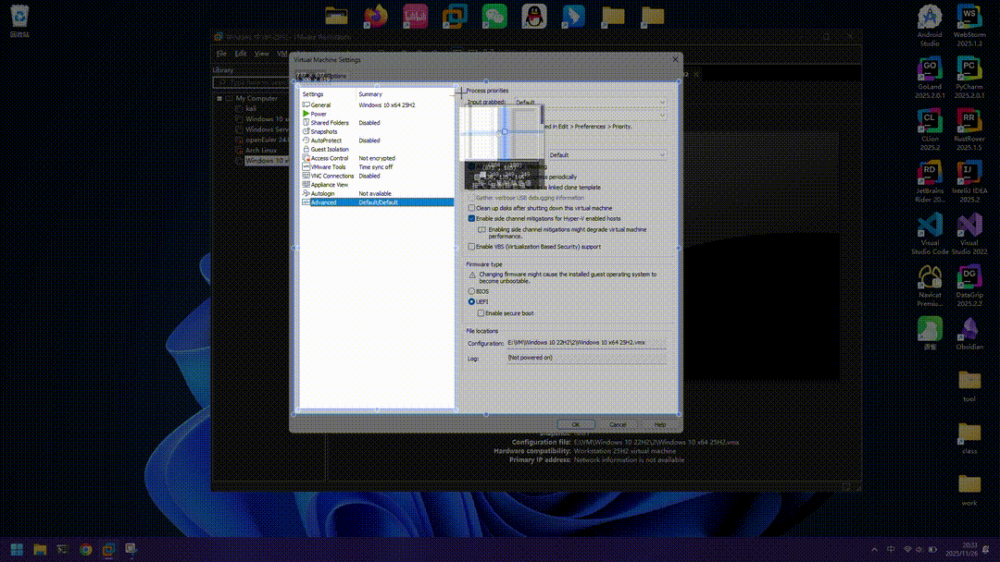

# OTSE

**OTSE** 是一个运行在 Windows 平台下的 C++ 辅助工具，旨在扩展 [Snipaste](https://www.snipaste.com/) 的截图功能。

它作为一个后台进程运行，当用户在使用 Snipaste 截图并按下 `Enter` 键后，程序会自动获取剪贴板中的截图，调用百度 AI 接口进行 **OCR 文字识别** 和 **翻译**，并将结果保存到本地文件，最后自动调用 Sublime Text 展示结果。



## 📋 功能特性

- **无缝集成**：配合 Snipaste 的快捷键逻辑，实现“截图 -> 识别 -> 翻译”的一键流。
- **云端识别**：集成百度智能云 OCR (通用文字识别) 接口。
- **自动翻译**：集成百度翻译 API，自动将识别结果翻译为中文。
- **本地归档**：自动在桌面创建临时目录保存截图及识别后的文本文件。
- **即时预览**：处理完成后自动弹出 Sublime Text 显示结果。

## 🛠️ 编译与环境要求

### 依赖项

- **操作系统**: Windows 10/11
- **编译器**: 支持 C++20 的编译器 (如 MSVC, MinGW)
- **构建工具**: CMake (VERSION 3.18+)
- **第三方库**: [nlohmann/json](https://github.com/nlohmann/json) (用于解析 API 返回数据)
- **外部软件**:

- [Snipaste](https://www.snipaste.com/)
- [Sublime Text](https://www.sublimetext.com/) (用于查看结果，或者可以使用系统自带的notepad)

### 编译步骤

1. 克隆或下载本项目代码。
2. 在项目根目录下创建一个构建目录：

```
mkdir build
cd build
```

3. 运行 CMake 配置与构建：

```
cmake ..
cmake --build . --config Release
```

4. 编译完成后，将在 `build` 或 `build/Release` 目录下生成 `OTSE.exe`。

## ⚙️ 配置指南 (重要)

在运行程序之前，必须完成以下配置，否则程序无法正常工作。

### 1. 代码配置

由于部分路径和 API 密钥包含在代码中，编译前请修改以下文件：

**修改** `main.h`**：** 请确认你的 Sublime Text 安装路径。找到以下代码并修改为你实际的 `sublime_text.exe` 路径（或者使用系统自带的notepad）：

```
// 修改为你电脑上的路径
inline std::string sublimePath = "D:\\Sublime Text\\sublime_text.exe"; 

// 或者使用notepad（系统自带，位于环境变量中）
inline std::string sublimePath = "notepad.exe"; 
```

**配置 API 密钥 (**`**passwd.h**`**)：**

1. 将项目根目录下的 `passwd.h.eg` 重命名为 `passwd.h`。
2. 填入你在百度智能云和百度翻译开放平台申请的 Key：

```
// 百度智能云 OCR 配置 ([https://console.bce.baidu.com/ai/](https://console.bce.baidu.com/ai/))
// 注意：client_id 即 API Key, client_secret 即 Secret Key
inline std::string aip_baidubce_com = "grant_type=client_credentials&client_id=【你的OCR_API_KEY】&client_secret=【你的OCR_SECRET_KEY】";

// 百度翻译开放平台配置 ([https://api.fanyi.baidu.com/](https://api.fanyi.baidu.com/))
inline std::string appid = "【你的翻译APPID】";
inline std::string secretKey = "【你的翻译密钥】";
```

### 2. Snipaste 软件设置

为了让程序正确拦截和获取图片，需对 Snipaste 进行如下设置：

1. **设置截屏键**：

- 打开 Snipaste `首选项` -> `快捷键` -> `全局快捷键`。
- 确保 OTSE 检测的截屏快捷键与Snipaste对应：设置为Ctrl + Shift + 1
- 或者修改代码，使用你想使用的快捷键。

2. **设置回车键行为**：

- 打开 Snipaste `首选项` -> `截屏` -> 行为。
- 确保 **回车键 (Enter)** 的功能被设置为：**“复制并退出截屏”**。

3. **设置图片复制格式**：

- 打开 Snipaste `首选项` -> `截屏` -> 行为。
- **取消勾选** “复制为 Windows Bitmap 格式”。
- _说明：本程序主要通过识别剪贴板中的 PNG 格式数据来工作。_

## 🚀 使用方法

### 启动程序

编译好 `OTSE.exe`后将其放置在合适的位置双击运行。程序启动后会隐藏在后台运行"。

### 操作流程

需两个程序同时运行（Snipaste 和 OTSE）。

1. **截图，激活触发器**：按下 Snipaste 截图快捷键，选定截图区域。

- _此时程序进入“待命状态”，等待用户确认。_

1. **确认识别**：在 **10秒内** 按下 `Enter` 键。

- Snipaste 会将图片复制到剪贴板并退出截图。
- OTSE 检测到 Enter 信号，自动读取剪贴板图片 -> OCR -> 翻译。

4. **查看结果**：稍等片刻，Sublime Text 将自动弹出，显示识别到的文字及翻译结果。

- _注意：激活触发器后会在超时和以下按键取消： `Esc` 以及 `Ctrl + c`

### 文件输出

程序会在你的 **桌面** 创建一个 `tmp` 文件夹：

- `desktop/tmp/tmp.png`：最近一次处理的截图。
- `desktop/tmp/tmp.txt`：最近一次的识别与翻译文本。

## 📅 建议：添加开机自启 (计划任务)

为了无需每次手动启动 `OTSE.exe`，建议将其添加到 Windows 计划任务中。

1. 按 `Win + R`，输入 `taskschd.msc` 打开任务计划程序。
2. 点击右侧 **“创建任务”**。
3. **常规**：

- 名称：`OTSE_Helper`
- 勾选 **“使用最高权限运行”** (确保键盘钩子生效)。

4. **触发器**：

- 新建 -> 开始任务：**“登录时”**。

5. **操作**：

- 新建 -> 操作：**“启动程序”**。
- 程序或脚本：选择你的 `OTSE.exe` 路径。
- **起始于(可选)**：填写 exe 所在的文件夹路径。

6. **条件**：

- 取消勾选 “只有在计算机使用交流电源时才启动此任务”（防止笔记本没插电不启动）。

7. 点击确定保存。下次重启电脑后程序将自动在后台运行。
